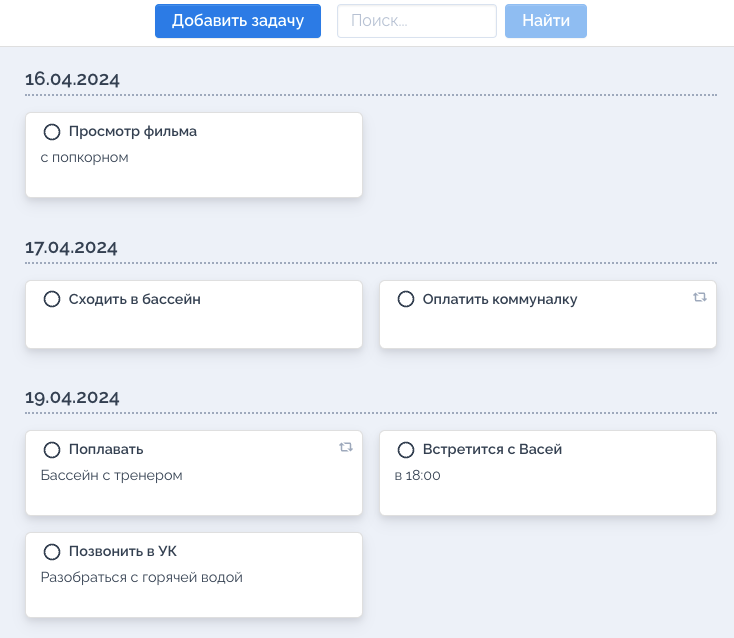
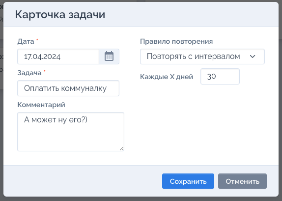

# Todo List in Go

## Overview
This project is a simple Todo List application written in Go. It uses a web server to manage tasks interactively through a user-friendly interface. The application is containerized using Docker, making it easy to deploy and run anywhere.

## Features
- **Create Tasks:** Add new tasks to your todo list.
- **View Tasks:** Display all your tasks in one view.
- **Update Tasks:** Modify the details of existing tasks.
- **Delete Tasks:** Remove tasks that are no longer needed.

## How to Use
You'll need Docker installed on your machine. To get this application up and running, follow these steps:

## Cloning the Repository
First, clone the repository to your local machine using the following command:
```bash
git clone https://github.com/Azark1n/go_todo_list.git
```
Or download this repository. Navigate to the directory containing the project.

### Building the Docker Image
Build the Docker image for this application by running:

```bash
docker build -t go_todo_list .
```

### Running the Container
Once the image is built, you can run the container using the following command:

```bash
docker run -d -p 7540:7540 --name go_todo_list -e TODO_PASSWORD=mysecretpassword go_todo_list
```

Replace your_secure_password with a secure password of your choice. This password will be used for the application's basic authentication.

### Accessing the Application
Once the container is running, open your web browser and navigate to:
http://localhost:7540

## Screenshots
Below are some screenshots of the Todo List application in action:

